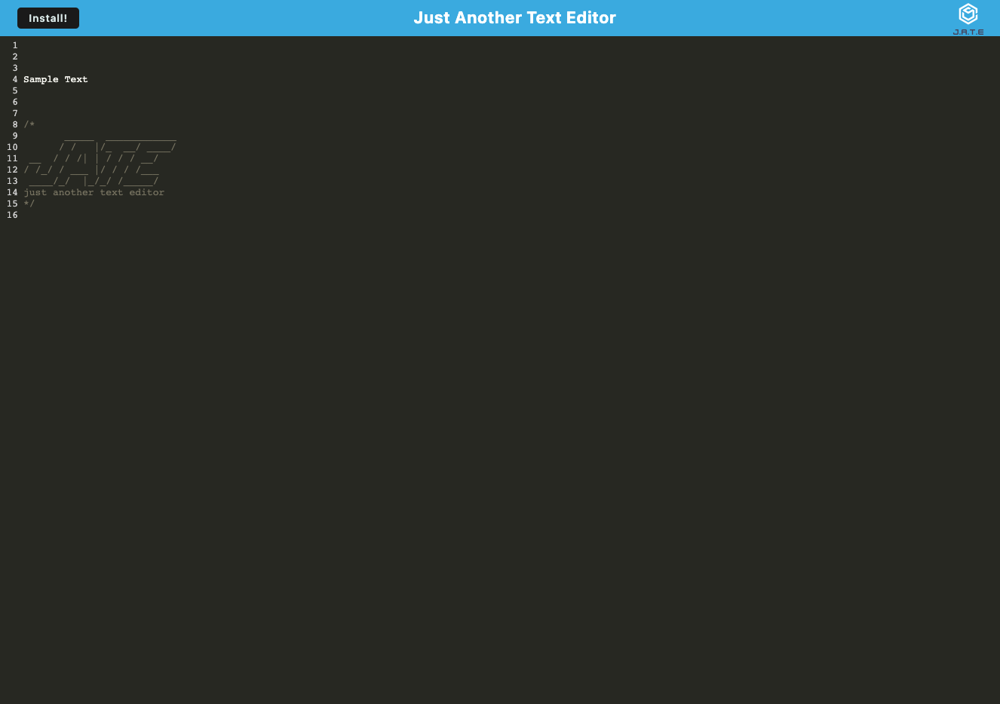

#  PWA Text Editor!

## Description

This application is a text editor for the browser. It is a Progressive Web Application, and can be used offline. It uses caching, service workers, and webpack.

In this project, I wanted to learn about the structure behind modern front-end frameworks like React. The new technologies made for a bit of a struggle, but eventually they became less obtuse. 

Follow this link to see the deployed application: https://jb-text-editor-pwa.herokuapp.com/

## Table of Contents 

- [Installation](#installation)
- [Usage](#usage)
- [License](#license)

## Installation

To get started with the project, follow the following guide:

1. Clone or copy the repo.
2. Run 'npm run start:dev' to get all necessary packages, start a server, and build the application. 
3. Navigate to http://localhost:3000/ to see the application.
## Usage

Below is a screenshot of the deployed application:

## License
MIT License

Copyright (c) 2022 Justus Brown

Permission is hereby granted, free of charge, to any person obtaining a copy
of this software and associated documentation files (the "Software"), to deal
in the Software without restriction, including without limitation the rights
to use, copy, modify, merge, publish, distribute, sublicense, and/or sell
copies of the Software, and to permit persons to whom the Software is
furnished to do so, subject to the following conditions:

The above copyright notice and this permission notice shall be included in all
copies or substantial portions of the Software.

THE SOFTWARE IS PROVIDED "AS IS", WITHOUT WARRANTY OF ANY KIND, EXPRESS OR
IMPLIED, INCLUDING BUT NOT LIMITED TO THE WARRANTIES OF MERCHANTABILITY,
FITNESS FOR A PARTICULAR PURPOSE AND NONINFRINGEMENT. IN NO EVENT SHALL THE
AUTHORS OR COPYRIGHT HOLDERS BE LIABLE FOR ANY CLAIM, DAMAGES OR OTHER
LIABILITY, WHETHER IN AN ACTION OF CONTRACT, TORT OR OTHERWISE, ARISING FROM,
OUT OF OR IN CONNECTION WITH THE SOFTWARE OR THE USE OR OTHER DEALINGS IN THE
SOFTWARE.